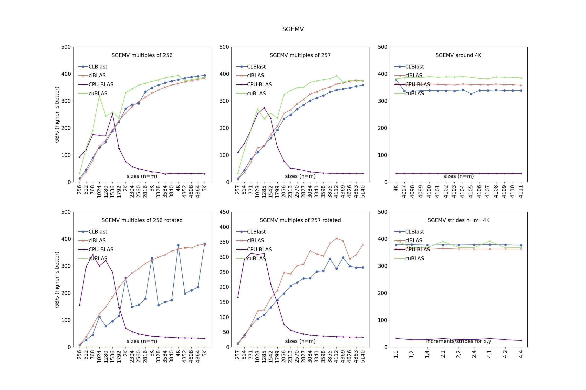
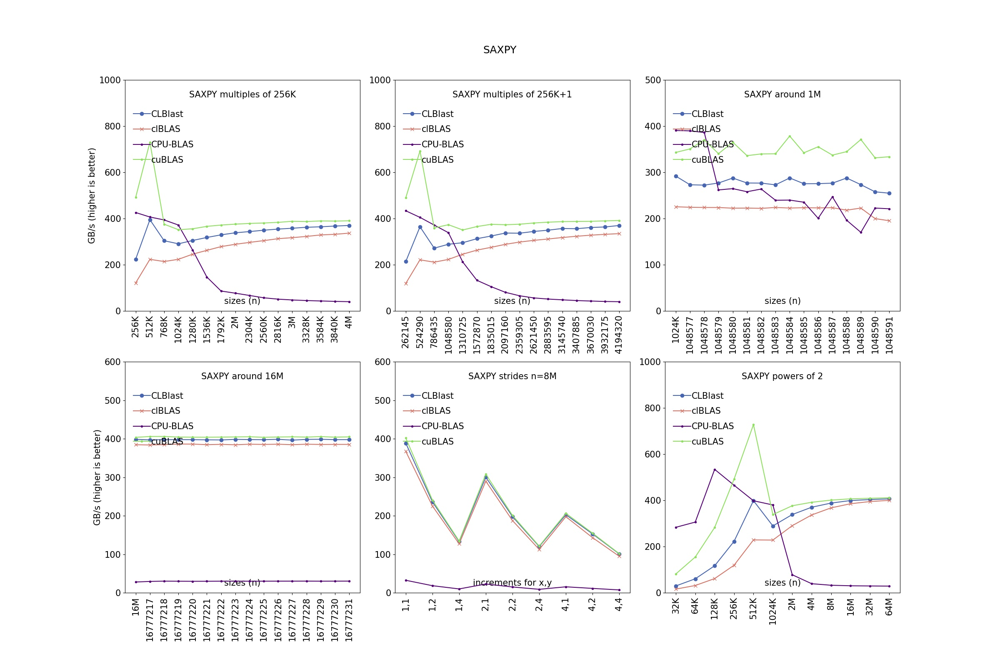
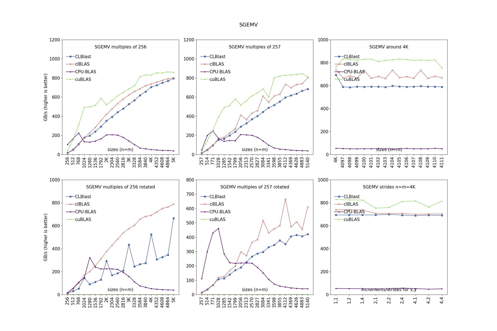
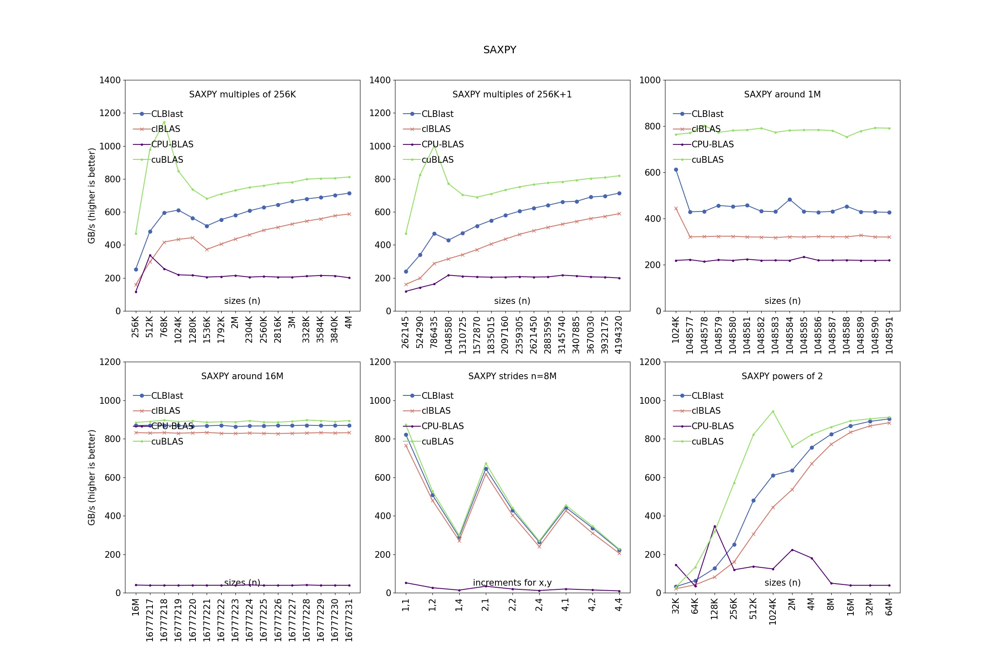
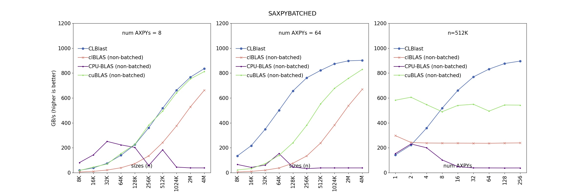

CLBlast: The tuned OpenCL BLAS library
================

## Windows

```bash
mkdir build
cd build
cmake -G "Visual Studio 15 2017 Win64" ^
	-DTUNERS=ON ^
	-DCMAKE_INSTALL_PREFIX=../dist/clblast ..
%comspec% /k "C:\Program Files (x86)\Microsoft Visual Studio\2017\Community\VC\Auxiliary\Build\vcvars64.bat"
msbuild /maxcpucount:4 /p:Configuration=Release /p:PreferredToolArchitecture=x64 clblast.vcxproj
msbuild /maxcpucount:4 /p:Configuration=Release /p:PreferredToolArchitecture=x64 alltuners.vcxproj
python ../scripts/database/database.py -v . ..
msbuild /maxcpucount:4 /p:Configuration=Release /p:PreferredToolArchitecture=x64 clblast.vcxproj -t:rebuild
msbuild /maxcpucount:4 /p:Configuration=Release /p:PreferredToolArchitecture=x64 INSTALL.vcxproj
```

## Ubuntu20.04LTS

### 编译并优化CLBlast

```bash
sudo apt install clinfo
clinfo -l # 获取Platform与Device信息
git clone --recursive https://github.com/SNSerHello/CLBlast.git
cd CLBlast
# 使用老数据编译CLBlast
# 老数据下载地址为： https://raw.githubusercontent.com/CNugteren/CLBlast-database/master/database.json
mkdir build
cd build
cmake .. -DTUNERS=ON -DCMAKE_INSTALL_PREFIX=../dist/clblast
make
# Finetuning kernel
make alltuners
python ../scripts/database/database.py -v . ..
# 使用新数据编译CLBlast
make
make install
```

### 编译并运行测试程序

```bash
cmake -DSAMPLES=ON ..
make
cmake -DTUNERS=ON ..
./clblast_sample_cache_c
./clblast_sample_dgemv_c
./clblast_sample_dtrsm
./clblast_sample_haxpy_c # 部分设备可能不支持半精度（错误代码：-2045）
./clblast_sample_samax_c
./clblast_sample_sasum_c
./clblast_sample_sgemm
./clblast_sample_sgemm_batched
./clblast_sample_sgemm_c
```

### Benchmarking

#### Ubuntu 20.04LTS

命令行中使用的是Anaconda3的环境变量，搭建Anaconda3环境请参考：[搭建Anaconda3环境](https://github.com/SNSerHello/MyNotes/tree/main/anaconda3)，其他的环境请修改相应的路径参数。

```bash
sudo apt install libmkl-full-dev libclblas-dev
cmake -DCLIENTS=ON \
	-DTESTS=ON \
	-DMKL_INCLUDE_DIRS=/usr/include/mkl \
	-DCUBLAS=ON \
	-DCUDA_ROOT=$CONDA_PREFIX \
	-DCMAKE_CXX_FLAGS=-I$CONDA_PREFIX/include ..
make -j
python3 ../scripts/benchmark/benchmark_all.py \
	--comparisons clBLAS CPU-BLAS cuBLAS  \
	--platform 0 \
	--device 0
```

**注意**：如果没有CUDA或者MKL安装，那么在命令行中删除对应部分即可。

#### Windows

```bash
conda install mkl-devel intel-openmp
cp ../prebuilt/intel-openmp/libiomp5md.lib %CONDA_PREFIX%/Library/lib/
cp ../prebuilt/intel-openmp/libiomp5md.exp %CONDA_PREFIX%/Library/lib/
cmake -G "Visual Studio 15 2017 Win64" ^
	-DCLIENTS=ON ^
	-DTESTS=ON ^
	-DCUBLAS=ON ^
	-DCUDA_ROOT=%CUDA_ROOT% ^
	-DMKL_ROOT=%CONDA_PREFIX%/Library ^
	-DCBLAS_ROOT=%CBLAS_ROOT% ^
	-DCBLAS_LIBRARIES=%CBLAS_ROOT%/lib/libcblas.lib ..
%comspec% /k "C:\Program Files (x86)\Microsoft Visual Studio\2017\Community\VC\Auxiliary\Build\vcvars64.bat"
msbuild /maxcpucount:4 /p:Configuration=Release /p:PreferredToolArchitecture=x64 ALL_BUILD.vcxproj
python3 ../scripts/benchmark/benchmark_all.py --comparisons clBLAS CPU-BLAS cuBLAS --platform 0 --device 0
```

CBLAS的编译在Windows下比较麻烦，它包含在lapack中，需要fortran编译器，为了省去`mingw`环境的搭建，预编译的库可以从[LAPACK for Windows](https://icl.utk.edu/lapack-for-windows/lapack/index.html#libraries)下载，头文件则从[lapack/CBLAS/include](https://github.com/SNSerHello/lapack/tree/master/CBLAS/include)目录中拷贝，组成的目录结构如下所示

```bash
cblas
├── bin
│   ├── libcblas.dll
│   ├── win32
│   └── x64
│       ├── libblas.dll
│       ├── libcblas.dll
│       ├── libgcc_s_seh-1.dll
│       ├── libgfortran-5.dll
│       ├── libquadmath-0.dll
│       └── libwinpthread-1.dll
├── include
│   ├── cblas.h
│   ├── cblas_f77.h
│   └── cblas_mangling.h
└── lib
    ├── libcblas.exp
    ├── libcblas.lib
    ├── win32
    └── x64
        ├── libblas.exp
        ├── libblas.lib
        ├── libcblas.exp
        └── libcblas.lib
```

**其中**

- `cblas_mangling.h`是修改`cblas_mangling_with_flags.h.in`的名字而获得的
- `win32`文件夹中存放预编译的`x86`动态库，`x64`文件夹中存放预编译的`x64`动态库
- `bin`与`lib`文件夹中放置当前使用的x86或者x64库，默认使用`x64`动态库


##### 如何制作`libiomp5md.lib`?

使用Anaconda安装的`intel-openmp`仅仅有`.dll`文件，没有对应的`.lib`文件，在链接的时候如果直接使用动态链接库，那么链接会失败，所以无奈必须手动制作`.lib`文件。

```bash
lib -machine:x64 -def:libiomp5md.def -out:libiomp5md.lib
```

**其中**

- `libiomp5md.def`存放在`prebuilt/intel-openmp`目录中

- `libiomp5md.dll`是从`%CONDA_PREFIX%/Library/bin`中拷贝而来的

  ```bash
  intel-openmp
  ├── libiomp5md.def
  ├── libiomp5md.dll
  ├── libiomp5md.exp
  └── libiomp5md.lib
  ```


#### 部分运行结果

##### NVIDIA 2070平台 in Windows







##### NVIDIA 3070平台 in Ubuntu20.04LTS


##### NVIDIA 3090TI平台 in Ubuntu20.04LTS








### 制定安装目录

将运行文件、头文件和库文件安装到dist目录下

#### Windows

```bash
cmake -G "Visual Studio 15 2017 Win64" ^
	-DBUILD_SHARED_LIBS=ON ^
	-DTUNERS=OFF ^
	-DCMAKE_INSTALL_PREFIX=../dist/clblast ..
%comspec% /k "C:\Program Files (x86)\Microsoft Visual Studio\2017\Community\VC\Auxiliary\Build\vcvars64.bat"
msbuild /maxcpucount:4 /p:Configuration=Release /p:PreferredToolArchitecture=x64 ALL_BUILD.vcxproj
msbuild /maxcpucount:4 /p:Configuration=Release /p:PreferredToolArchitecture=x64 INSTALL.vcxproj
```

##### 安装内容

```bash
clblast
├── include
│   ├── clblast.h
│   ├── clblast_c.h
│   └── clblast_half.h
└── lib
    ├── clblast.dll
    ├── clblast.lib
    └── cmake
        └── CLBlast
            ├── CLBlastConfig-release.cmake
            └── CLBlastConfig.cmake
```

#### Ubuntu20.04LTS

```bash
cmake -DCLIENTS=ON \
	-DTESTS=ON \
	-DMKL_INCLUDE_DIRS=/usr/include/mkl \
	-DCUBLAS=ON \
	-DCUDA_ROOT=$CONDA_PREFIX \
	-DCMAKE_CXX_FLAGS=-I$CONDA_PREFIX/include \
	-DCMAKE_INSTALL_PREFIX=../dist/clblast ..
make -j
make install
```

##### 安装内容

```bash
dist/clblast
├── bin
│   ├── clblast_client_xamax
│   ├── clblast_client_xasum
│   ├── clblast_client_xaxpy
│   ├── clblast_client_xaxpybatched
│   ├── clblast_client_xcol2im
│   ├── clblast_client_xconvgemm
│   ├── clblast_client_xcopy
│   ├── clblast_client_xdot
│   ├── clblast_client_xdotc
│   ├── clblast_client_xdotu
│   ├── clblast_client_xgbmv
│   ├── clblast_client_xgemm
│   ├── clblast_client_xgemmbatched
│   ├── clblast_client_xgemmstridedbatched
│   ├── clblast_client_xgemv
│   ├── clblast_client_xger
│   ├── clblast_client_xgerc
│   ├── clblast_client_xgeru
│   ├── clblast_client_xhad
│   ├── clblast_client_xhbmv
│   ├── clblast_client_xhemm
│   ├── clblast_client_xhemv
│   ├── clblast_client_xher
│   ├── clblast_client_xher2
│   ├── clblast_client_xher2k
│   ├── clblast_client_xherk
│   ├── clblast_client_xhpmv
│   ├── clblast_client_xhpr
│   ├── clblast_client_xhpr2
│   ├── clblast_client_xim2col
│   ├── clblast_client_xnrm2
│   ├── clblast_client_xomatcopy
│   ├── clblast_client_xsbmv
│   ├── clblast_client_xscal
│   ├── clblast_client_xspmv
│   ├── clblast_client_xspr
│   ├── clblast_client_xspr2
│   ├── clblast_client_xswap
│   ├── clblast_client_xsymm
│   ├── clblast_client_xsymv
│   ├── clblast_client_xsyr
│   ├── clblast_client_xsyr2
│   ├── clblast_client_xsyr2k
│   ├── clblast_client_xsyrk
│   ├── clblast_client_xtbmv
│   ├── clblast_client_xtpmv
│   ├── clblast_client_xtrmm
│   ├── clblast_client_xtrmv
│   ├── clblast_client_xtrsm
│   ├── clblast_client_xtrsv
│   ├── clblast_test_xamax
│   ├── clblast_test_xasum
│   ├── clblast_test_xaxpy
│   ├── clblast_test_xaxpybatched
│   ├── clblast_test_xcol2im
│   ├── clblast_test_xconvgemm
│   ├── clblast_test_xcopy
│   ├── clblast_test_xdot
│   ├── clblast_test_xdotc
│   ├── clblast_test_xdotu
│   ├── clblast_test_xgbmv
│   ├── clblast_test_xgemm
│   ├── clblast_test_xgemmbatched
│   ├── clblast_test_xgemmstridedbatched
│   ├── clblast_test_xgemv
│   ├── clblast_test_xger
│   ├── clblast_test_xgerc
│   ├── clblast_test_xgeru
│   ├── clblast_test_xhad
│   ├── clblast_test_xhbmv
│   ├── clblast_test_xhemm
│   ├── clblast_test_xhemv
│   ├── clblast_test_xher
│   ├── clblast_test_xher2
│   ├── clblast_test_xher2k
│   ├── clblast_test_xherk
│   ├── clblast_test_xhpmv
│   ├── clblast_test_xhpr
│   ├── clblast_test_xhpr2
│   ├── clblast_test_xim2col
│   ├── clblast_test_xnrm2
│   ├── clblast_test_xomatcopy
│   ├── clblast_test_xsbmv
│   ├── clblast_test_xscal
│   ├── clblast_test_xspmv
│   ├── clblast_test_xspr
│   ├── clblast_test_xspr2
│   ├── clblast_test_xswap
│   ├── clblast_test_xsymm
│   ├── clblast_test_xsymv
│   ├── clblast_test_xsyr
│   ├── clblast_test_xsyr2
│   ├── clblast_test_xsyr2k
│   ├── clblast_test_xsyrk
│   ├── clblast_test_xtbmv
│   ├── clblast_test_xtpmv
│   ├── clblast_test_xtrmm
│   ├── clblast_test_xtrmv
│   ├── clblast_test_xtrsm
│   ├── clblast_test_xtrsv
│   ├── clblast_tuner_copy_fast
│   ├── clblast_tuner_copy_pad
│   ├── clblast_tuner_invert
│   ├── clblast_tuner_routine_xgemm
│   ├── clblast_tuner_routine_xtrsv
│   ├── clblast_tuner_transpose_fast
│   ├── clblast_tuner_transpose_pad
│   ├── clblast_tuner_xaxpy
│   ├── clblast_tuner_xconvgemm
│   ├── clblast_tuner_xdot
│   ├── clblast_tuner_xgemm
│   ├── clblast_tuner_xgemm_direct
│   ├── clblast_tuner_xgemv
│   └── clblast_tuner_xger
├── include
│   ├── clblast_c.h
│   ├── clblast.h
│   └── clblast_half.h
└── lib
    ├── cmake
    │   └── CLBlast
    │       ├── CLBlastConfig.cmake
    │       └── CLBlastConfig-noconfig.cmake
    ├── libclblast.so -> libclblast.so.1
    ├── libclblast.so.1 -> libclblast.so.1.5.2
    ├── libclblast.so.1.5.2
    └── pkgconfig
        └── clblast.pc
```

可以使用这些安装的可执行文件进行finetuning操作，比如

```bash
$ ../dist/clblast/bin/clblast_tuner_xdot -precision 32
* Options given/available:
    -platform 0 [=default]
    -device 0 [=default]
    -precision 32 (single) [=default]
    -n 2097152 [=default]
    -fraction 1.00 [=default]
    -runs 10 [=default]
    -max_l2_norm 0.00 [=default]

* Found 6 configuration(s)
* Parameters explored: WGS1

|   ID | total |param |      local      |      global     |       compiles |         time |   GB/s |            status |
x------x-------x------x-----------------x-----------------x----------------x--------------x--------x-------------------x
|  ref |     - |    - |      64       1 |    8192       1 |             OK |      0.10 ms |      - |      reference OK |
x------x-------x------x-----------------x-----------------x----------------x--------------x--------x-------------------x
|    1 |     6 |   32 |      32       1 |    4096       1 |   OK     68 ms |      0.19 ms |   88.7 |     results match |
|    2 |     6 |   64 |      64       1 |    8192       1 |   OK     46 ms |      0.10 ms |  162.7 |     results match |
|    3 |     6 |  128 |     128       1 |   16384       1 |   OK     69 ms |      0.06 ms |  270.8 |     results match |
|    4 |     6 |  256 |     256       1 |   32768       1 |   OK     70 ms |      0.05 ms |  317.7 |     results match |
|    5 |     6 |  512 |     512       1 |   65536       1 |   OK     70 ms |      0.05 ms |  319.0 |     results match |
|    6 |     6 | 1024 |    1024       1 |  131072       1 |   OK     70 ms |      0.06 ms |  301.5 |     results match |
x------x-------x------x-----------------x-----------------x----------------x--------------x--------x-------------------x


* Got average result of 0.09 ms: 195.4 GB/s
* Found best result 0.05 ms: 319.0 GB/s
* Best parameters: PRECISION=32 WGS1=512

* Writing a total of 6 results to 'clblast_xdot_1_32.json'
* Completed tuning process

* Options given/available:
    -platform 0 [=default]
    -device 0 [=default]
    -precision 32 (single) [=default]
    -n 2097152 [=default]
    -fraction 1.00 [=default]
    -runs 10 [=default]
    -max_l2_norm 0.00 [=default]

* Found 6 configuration(s)
* Parameters explored: WGS2

|   ID | total |param |      local      |      global     |       compiles |         time |    N/A |            status |
x------x-------x------x-----------------x-----------------x----------------x--------------x--------x-------------------x
|  ref |     - |    - |      64       1 |      64       1 |             OK |      0.01 ms |      - |      reference OK |
x------x-------x------x-----------------x-----------------x----------------x--------------x--------x-------------------x
|    1 |     6 |   32 |      32       1 |      32       1 |   OK     69 ms |      0.01 ms |    0.0 |     results match |
|    2 |     6 |   64 |      64       1 |      64       1 |   OK     46 ms |      0.01 ms |    0.0 |     results match |
|    3 |     6 |  128 |     128       1 |     128       1 |   OK     69 ms |      0.01 ms |    0.0 |     results match |
|    4 |     6 |  256 |     256       1 |     256       1 |   OK     70 ms |      0.01 ms |    0.0 |     results match |
|    5 |     6 |  512 |     512       1 |     512       1 |   OK     70 ms |      0.01 ms |    0.0 |     results match |
|    6 |     6 | 1024 |    1024       1 |    1024       1 |   OK     70 ms |      0.01 ms |    0.0 |     results match |
x------x-------x------x-----------------x-----------------x----------------x--------------x--------x-------------------x


* Got average result of 0.01 ms: 0.0 N/A
* Found best result 0.01 ms: 0.0 N/A
* Best parameters: PRECISION=32 WGS2=64

* Writing a total of 6 results to 'clblast_xdot_2_32.json'
* Completed tuning process
```

罗列可能存在的Finetuning操作

```bash
../dist/clblast/bin/clblast_tuner_copy_fast -precision 32
../dist/clblast/bin/clblast_tuner_copy_fast -precision 64
../dist/clblast/bin/clblast_tuner_copy_fast -precision 3232
../dist/clblast/bin/clblast_tuner_copy_fast -precision 6464
../dist/clblast/bin/clblast_tuner_copy_fast -precision 16
../dist/clblast/bin/clblast_tuner_copy_pad -precision 32
../dist/clblast/bin/clblast_tuner_copy_pad -precision 64
../dist/clblast/bin/clblast_tuner_copy_pad -precision 3232
../dist/clblast/bin/clblast_tuner_copy_pad -precision 6464
../dist/clblast/bin/clblast_tuner_copy_pad -precision 16
../dist/clblast/bin/clblast_tuner_transpose_fast -precision 32
../dist/clblast/bin/clblast_tuner_transpose_fast -precision 64
../dist/clblast/bin/clblast_tuner_transpose_fast -precision 3232
../dist/clblast/bin/clblast_tuner_transpose_fast -precision 6464
../dist/clblast/bin/clblast_tuner_transpose_fast -precision 16
../dist/clblast/bin/clblast_tuner_transpose_pad -precision 32
../dist/clblast/bin/clblast_tuner_transpose_pad -precision 64
../dist/clblast/bin/clblast_tuner_transpose_pad -precision 3232
../dist/clblast/bin/clblast_tuner_transpose_pad -precision 6464
../dist/clblast/bin/clblast_tuner_transpose_pad -precision 16
../dist/clblast/bin/clblast_tuner_xaxpy -precision 32
../dist/clblast/bin/clblast_tuner_xaxpy -precision 64
../dist/clblast/bin/clblast_tuner_xaxpy -precision 3232
../dist/clblast/bin/clblast_tuner_xaxpy -precision 6464
../dist/clblast/bin/clblast_tuner_xaxpy -precision 16
../dist/clblast/bin/clblast_tuner_xdot -precision 32
../dist/clblast/bin/clblast_tuner_xdot -precision 64
../dist/clblast/bin/clblast_tuner_xdot -precision 3232
../dist/clblast/bin/clblast_tuner_xdot -precision 6464
../dist/clblast/bin/clblast_tuner_xdot -precision 16
../dist/clblast/bin/clblast_tuner_xger -precision 32
../dist/clblast/bin/clblast_tuner_xger -precision 64
../dist/clblast/bin/clblast_tuner_xger -precision 3232
../dist/clblast/bin/clblast_tuner_xger -precision 6464
../dist/clblast/bin/clblast_tuner_xger -precision 16
../dist/clblast/bin/clblast_tuner_xgemm -precision 32
../dist/clblast/bin/clblast_tuner_xgemm -precision 64
../dist/clblast/bin/clblast_tuner_xgemm -precision 3232
../dist/clblast/bin/clblast_tuner_xgemm -precision 6464
../dist/clblast/bin/clblast_tuner_xgemm -precision 16
../dist/clblast/bin/clblast_tuner_xgemm_direct -precision 32
../dist/clblast/bin/clblast_tuner_xgemm_direct -precision 64
../dist/clblast/bin/clblast_tuner_xgemm_direct -precision 3232
../dist/clblast/bin/clblast_tuner_xgemm_direct -precision 6464
../dist/clblast/bin/clblast_tuner_xgemm_direct -precision 16
../dist/clblast/bin/clblast_tuner_xgemv -precision 32
../dist/clblast/bin/clblast_tuner_xgemv -precision 64
../dist/clblast/bin/clblast_tuner_xgemv -precision 3232
../dist/clblast/bin/clblast_tuner_xgemv -precision 6464
../dist/clblast/bin/clblast_tuner_xgemv -precision 16
../dist/clblast/bin/clblast_tuner_invert -precision 32
../dist/clblast/bin/clblast_tuner_invert -precision 64
../dist/clblast/bin/clblast_tuner_invert -precision 3232
../dist/clblast/bin/clblast_tuner_invert -precision 6464
../dist/clblast/bin/clblast_tuner_invert -precision 16
../dist/clblast/bin/clblast_tuner_routine_xgemm -precision 32
../dist/clblast/bin/clblast_tuner_routine_xgemm -precision 64
../dist/clblast/bin/clblast_tuner_routine_xgemm -precision 3232
../dist/clblast/bin/clblast_tuner_routine_xgemm -precision 6464
../dist/clblast/bin/clblast_tuner_routine_xgemm -precision 16
../dist/clblast/bin/clblast_tuner_routine_xtrsv -precision 32
../dist/clblast/bin/clblast_tuner_routine_xtrsv -precision 64
../dist/clblast/bin/clblast_tuner_routine_xtrsv -precision 3232
../dist/clblast/bin/clblast_tuner_routine_xtrsv -precision 6464
../dist/clblast/bin/clblast_tuner_routine_xtrsv -precision 16
```

### 编译CLBlast静态库

```bash
cmake -DCLIENTS=ON \
	-DTESTS=ON \
	-DMKL_INCLUDE_DIRS=/usr/include/mkl \
	-DCUBLAS=ON \
	-DCUDA_ROOT=$CONDA_PREFIX \
	-DCMAKE_CXX_FLAGS=-I$CONDA_PREFIX/include \
	-DCMAKE_INSTALL_PREFIX=../dist/clblast \
	-DBUILD_SHARED_LIBS=OFF ..
make -j
make install
```

## 未实现的CLBLAS函数

### 非CUDA版本

- BLAS level-1 (vector-vector)
  - SROTG/DROTG
  - SROTMG/DROTMG
  - SROT/DROT
  - SROTM/DROTM
- BLAS level-2 (matrix-vector)
  - STBSV/DTBSV/CTBSV/ZTBSV
  - STPSV/DTPSV/CTPSV/ZTPSV
- BLAS level-3 (matrix-matrix)
  - None

### CUDA版本

- BLAS level-1 (vector-vector)
  - SROTG/DROTG
  - SROTMG/DROTMG
  - SROT/DROT
  - SROTM/DROTM
- BLAS level-2 (matrix-vector)
  - STBSV/DTBSV/CTBSV/ZTBSV
  - STPSV/DTPSV/CTPSV/ZTPSV
- BLAS level-3 (matrix-matrix)
  - None

### 参考

- [Performance results for Titan X (Pascal)](https://cnugteren.github.io/clblast/results/titanxpascal.html)
- [CLBlast: API reference](https://github.com/SNSerHello/CLBlast/blob/master/doc/api.md)
- [Tutorial: OpenCL SGEMM tuning for Kepler](https://cnugteren.github.io/tutorial/pages/page1.html)
- [BLAS Routines](https://oneapi-src.github.io/oneMKL/domains/blas/blas.html)
- [Anaconda3](https://github.com/SNSerHello/MyNotes/tree/main/anaconda3)
- [MSBuild command-line reference](https://docs.microsoft.com/en-us/visualstudio/msbuild/msbuild-command-line-reference?view=vs-2022)
- [BLAS (Basic Linear Algebra Subprograms)](https://netlib.org/blas/)
- [LAPACK for Windows](https://icl.utk.edu/lapack-for-windows/lapack/index.html#libraries)
- [Creating an Import Library](https://gcc.gnu.org/onlinedocs/gnat_ugn/Creating-an-Import-Library.html)
- [oneAPI Math Kernel Library (oneMKL) Interfaces](https://github.com/oneapi-src/oneMKL)
- [Intel(R) oneAPI Math Kernel Library for x86 CPU](https://software.intel.com/en-us/oneapi/onemkl)
- [Intel(R) oneAPI Math Kernel Library for x86 CPU](https://software.intel.com/en-us/oneapi/onemkl)


## CLBlast Build Status

| Platform | Build status |
|-----|-----|
| Windows | [](https://ci.appveyor.com/project/CNugteren/clblast) |
| Linux | [](https://travis-ci.org/CNugteren/CLBlast/branches) |
| OS X | [](https://travis-ci.org/CNugteren/CLBlast/branches) |

| Test machine (thanks to [ArrayFire](https://ci.arrayfire.org:8010/#/builders)) | Test status |
|-----|-----|
| clblast-linux-nvidia-a100 | [](http://ci.arrayfire.org:8010/#/builders/clblast-linux-nvidia-a100) |
| clblast-linux-nvidia-k80 | [](http://ci.arrayfire.org:8010/#/builders/clblast-linux-nvidia-k80) |
| clblast-linux-nvidia-p100 | [](http://ci.arrayfire.org:8010/#/builders/clblast-linux-nvidia-p100) |
| clblast-linux-nvidia-t4 | [](http://ci.arrayfire.org:8010/#/builders/clblast-linux-nvidia-t4) |
| clblast-linux-nvidia-v100 | [](http://ci.arrayfire.org:8010/#/builders/clblast-linux-nvidia-v100) |
| clblast-windows-amd-r9 | [](http://ci.arrayfire.org:8010/#/builders/clblast-windows-amd-r9) |
| clblast-windows-nvidia-m6000 | [](http://ci.arrayfire.org:8010/#/builders/clblast-windows-nvidia-m6000) |

CLBlast is a modern, lightweight, performant and tunable OpenCL BLAS library written in C++11. It is designed to leverage the full performance potential of a wide variety of OpenCL devices from different vendors, including desktop and laptop GPUs, embedded GPUs, and other accelerators. CLBlast implements BLAS routines: basic linear algebra subprograms operating on vectors and matrices. See [the CLBlast website](https://cnugteren.github.io/clblast) for performance reports on various devices as well as the latest CLBlast news.

The library is not tuned for all possible OpenCL devices: __if out-of-the-box performance is poor, please run the tuners first__. See below for a list of already tuned devices and instructions on how to tune yourself and contribute to future releases of the CLBlast library. See also the [CLBlast feature roadmap](ROADMAP.md) to get an indication of the future of CLBlast.


Why CLBlast and not clBLAS or cuBLAS?
-------------

Use CLBlast instead of clBLAS:

* When you care about achieving maximum performance.
* When you want to be able to inspect the BLAS kernels or easily customize them to your needs.
* When you run on exotic OpenCL devices for which you need to tune yourself.
* When you are still running on OpenCL 1.1 hardware.
* When you prefer a C++ API over a C API (C API also available in CLBlast).
* When you value an organized and modern C++ codebase.
* When you target Intel CPUs and GPUs or embedded devices.
* When you can benefit from the increased performance of half-precision fp16 data-types.

Use CLBlast instead of cuBLAS:

* When you want your code to run on devices other than NVIDIA CUDA-enabled GPUs.
* When you want to tune for a specific configuration (e.g. rectangular matrix-sizes).
* When you sleep better if you know that the library you use is open-source.
* When you are using OpenCL rather than CUDA.

When not to use CLBlast:

* When you run on NVIDIA's CUDA-enabled GPUs only and can benefit from cuBLAS's assembly-level tuned kernels.


Getting started
-------------

CLBlast can be compiled with minimal dependencies (apart from OpenCL) in the usual CMake-way, e.g.:

    mkdir build && cd build
    cmake ..
    make

Detailed instructions for various platforms can be found are [here](doc/installation.md).

Like clBLAS and cuBLAS, CLBlast also requires OpenCL device buffers as arguments to its routines. This means you'll have full control over the OpenCL buffers and the host-device memory transfers. CLBlast's API is designed to resemble clBLAS's C API as much as possible, requiring little integration effort in case clBLAS was previously used. Using CLBlast starts by including the C++ header:

    #include <clblast.h>

Or alternatively the plain C version:

    #include <clblast_c.h>

Afterwards, any of CLBlast's routines can be called directly: there is no need to initialize the library. The available routines and the required arguments are described in the above mentioned include files and the included [API documentation](doc/api.md). The API is kept as close as possible to the Netlib BLAS and the cuBLAS/clBLAS APIs. For an overview of the supported routines, see [here](doc/routines.md).

To get started quickly, a couple of stand-alone example programs are included in the `samples` subfolder. They can optionally be compiled using the CMake infrastructure of CLBlast by providing the `-DSAMPLES=ON` flag, for example as follows:

    cmake -DSAMPLES=ON ..

Afterwards, you can optionally read more about running proper [benchmarks](doc/benchmarking.md) and [tuning the library](doc/tuning.md).


Full documentation
-------------

More detailed documentation is available in separate files:

* [Building and installing](doc/installation.md)
* [Supported routines overview](doc/routines.md)
* [Performance measuring and benchmarking](doc/benchmarking.md)
* [Tuning for better performance](doc/tuning.md)
* [Testing the library for correctness](doc/testing.md)
* [Bindings / wrappers for other languages](doc/bindings.md)
* [More details on the GEMM kernel](doc/details_gemm.md)
* [More details on the convolution implementation](doc/details_conv.md)
* [Glossary with some terms explained](doc/glossary.md)
* [Frequently asked questions (FAQ) and their answers](doc/faq.md)


Known issues
-------------

Known performance related issues:

* Severe performance issues with Beignet v1.3.0 due to missing support for local memory. Please downgrade to v1.2.1 or upgrade to v1.3.1 or newer.

* Performance issues on Qualcomm Adreno GPUs.

Other known issues:

* Routines returning an integer are currently not properly tested for half-precision FP16: IHAMAX/IHAMIN/IHMAX/IHMIN

* Half-precision FP16 tests might sometimes fail based on order multiplication, i.e. (a * b) * c != (c * b) * a

* The AMD APP SDK has a bug causing a conflict with libstdc++, resulting in a segfault when initialising static variables. This has been reported to occur with the CLBlast tuners.

* The AMD run-time compiler has a bug causing it to get stuck in an infinite loop. This is reported to happen occasionally when tuning the CLBlast GEMM routine.

* AMD Southern Island GPUs might cause wrong results with the amdgpu-pro drivers. Do configure CMake with `AMD_SI_EMPTY_KERNEL_WORKAROUND` to resolve the issue, [see issue #301](https://github.com/CNugteren/CLBlast/issues/301).

* Tests might fail on an Intel IvyBridge GPU with the latest Beignet. Please downgrade Beignet to 1.2.1, [see issue #231](https://github.com/CNugteren/CLBlast/issues/231).


Contributing
-------------

Contributions are welcome in the form of tuning results for OpenCL devices previously untested or pull requests. See [the contributing guidelines](CONTRIBUTING.md) for more details.

The main contributing authors (code, pull requests, testing) are:

* [Cedric Nugteren](http://cnugteren.github.io) - main author
* [Anton Lokhmotov](https://github.com/psyhtest)
* [Dragan Djuric](https://github.com/blueberry)
* [Marco Hutter](http://marco-hutter.de/)
* [Hugh Perkins](https://github.com/hughperkins)
* [Gian-Carlo Pascutto](https://github.com/gcp)
* [Ivan Shapovalov](https://github.com/intelfx)
* [Dimitri Van Assche](https://github.com/dvasschemacq)
* [Shehzan Mohammed](https://shehzan10.github.io)
* [Marco Cianfriglia](https://github.com/mcian)
* [Kodonnell](https://github.com/kodonnell)
* [Koichi Akabe](https://github.com/vbkaisetsu)
* Everyone else listed as a [GitHub contributor](https://github.com/CNugteren/CLBlast/graphs/contributors)

Tuning and testing on a variety of OpenCL devices was made possible by:

* [TU/e ES research group](http://www.es.ele.tue.nl/)
* [ASCI DAS4 and DAS5](http://www.cs.vu.nl/das4/)
* [dividiti](http://www.dividiti.com)
* [SURFsara HPC center](http://www.surfsara.com)
* [ArrayFire](http://arrayfire.org)
* [TomTom](http://www.tomtom.com)
* Everyone reporting [tuning results](https://github.com/CNugteren/CLBlast/issues/1)

Hardware/software for this project was contributed by:

* [HPC research group at the University of Bristol](http://uob-hpc.github.io/zoo/) for access to their GPU zoo
* [ArrayFire](http://arrayfire.org) for settings up and supporting Buildbot correctness tests on multiple platforms
* [JetBrains](https://www.jetbrains.com/clion/) for supply a free CLion IDE license for CLBlast developers
* [Travis CI](https://travis-ci.org/CNugteren/CLBlast/branches) and [AppVeyor](https://ci.appveyor.com/project/CNugteren/clblast) for free automated build tests for open-source projects


More information
-------------

Further information on CLBlast is available through the following links:

* A 20-minute presentation of CLBlast was given at the GPU Technology Conference in May 2017. A recording is available on the [GTC on-demand website](http://on-demand.gputechconf.com/gtc/2017/video/s7280-nugteren-clblast.mp4) (poor audio quality however) and a full slide-set is also available [as PDF](http://on-demand.gputechconf.com/gtc/2017/presentation/s7280-cedric-nugteren-clblast.pdf). An updated version was also presented at IWOCL in May 2018. The slide set can be found [here as PDF](https://cnugteren.github.io/downloads/CLBlastIWOCL18.pdf).
* More in-depth information and experimental results are also available in a scientific paper titled [CLBlast: A Tuned OpenCL BLAS Library](https://arxiv.org/abs/1705.05249) (v1 May 2017, updated to v2 in April 2018). For CLTune, the inspiration for the included auto-tuner, see also the [CLTune: A Generic Auto-Tuner for OpenCL Kernels](https://arxiv.org/abs/1703.06503) paper.

How to cite this work:

    Cedric Nugteren. CLBlast: A Tuned OpenCL BLAS Library. In IWOCL'18: International Workshop
    on OpenCL. ACM, New York, NY, USA, 10 pages. 2018. https://doi.org/10.1145/3204919.3204924


Support us
-------------

This project started in March 2015 as an evenings and weekends free-time project next to a full-time job for Cedric Nugteren. If you are in the position to support the project by OpenCL-hardware donations or otherwise, please find contact information on the [website of the main author](http://cnugteren.github.io).
